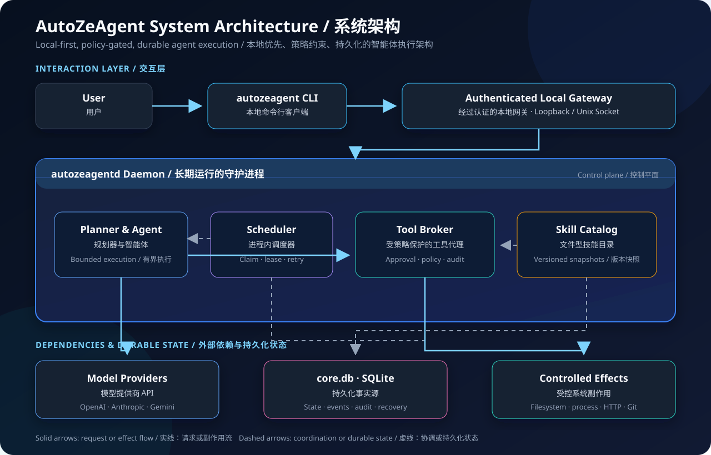

# AutoZeAgent

[](https://go.dev/)
[](LICENSE)
[](#project-status--项目状态)

A local-first, policy-controlled automation agent built in Go.

一个使用 Go 构建的、本地优先且受策略控制的自动化智能体。

AutoZeAgent turns long-running goals into persistent tasks, reviewable plans, recoverable runs, controlled tool calls, and auditable local state.

AutoZeAgent 将长期目标转化为持久化任务、可审查计划、可恢复运行、受控工具调用以及可审计的本地状态。

> **Alpha software:** AutoZeAgent is under active development and should be reviewed carefully before it is used with important data or privileged credentials.
>
> **Alpha 阶段软件：** AutoZeAgent 仍在积极开发中，在接触重要数据或高权限凭据之前，请先认真检查配置、策略和权限边界。

## Project introduction / 项目介绍

AutoZeAgent is designed for automation work that cannot be represented safely as a single prompt or a short-lived process.

AutoZeAgent 面向无法安全地用单次提示词或短生命周期进程表达的自动化工作。

A user submits a persistent **Task**, the planner produces a reviewable **Plan**, approvals authorize specific actions, and one or more recoverable **Runs** carry the work forward.

用户提交一个持久化的 **Task（任务）**，规划器生成可审查的 **Plan（计划）**，审批授权具体操作，一个或多个可恢复的 **Run（运行）** 持续推进工作。

The production system intentionally contains only one long-running daemon, one local CLI (including the interactive TUI), and one SQLite source of truth. CLI subcommands and the TUI are peers that talk only to the local Gateway.

生产系统刻意只保留一个长期运行的守护进程、一个本地命令行客户端（含交互式 TUI）和一个 SQLite 事实源。CLI 子命令与 TUI 并列，仅访问本地 Gateway。

```text
autozeagentd   one long-running daemon
           一个长期运行的守护进程

autozeagent    one local CLI (+ TUI; peers via gatewayclient)
           一个本地 CLI（含 TUI；经 gatewayclient 并列访问 Gateway）

core.db    one SQLite source of truth
           一个 SQLite 持久化事实源
```

The current implementation includes persistent tasks and plans, approval and capability grants, recoverable agent runs, a policy-gated Tool Broker, scheduled jobs, provider integrations, file-based skills, structured logs, diagnostics, and audit records.

当前实现包括持久化任务与计划、审批与能力授权、可恢复的智能体运行、受策略保护的 Tool Broker、定时任务、模型提供商集成、文件型技能、结构化日志、诊断功能和审计记录。

## Why it is designed this way / 为什么这样设计

AutoZeAgent is built around a simple idea: an automation agent should be able to work for a long time without becoming an unbounded process that silently owns the machine.

AutoZeAgent 围绕一个简单想法构建：自动化智能体可以长时间工作，但不应该变成一个不受约束、悄悄接管机器的进程。

- **Persistence instead of prompt history.** Important state is stored as explicit domain records rather than depending on an in-memory conversation.
  - **用持久化代替提示词历史。** 重要状态以明确的领域记录保存，而不是依赖内存中的对话上下文。
- **Plans before effects.** Actions can be inspected and approved before tools are allowed to change the system.
  - **先计划，再产生副作用。** 在工具被允许修改系统之前，可以先检查并审批计划中的操作。
- **Recovery instead of blind retries.** Provider and tool records make it possible to continue after interruption without repeating already completed tool calls.
  - **用恢复代替盲目重试。** Provider 和工具记录允许系统在中断后继续运行，同时避免重复已经成功完成的工具调用。
- **One database instead of distributed state.** A single SQLite database keeps task, execution, scheduling, event, and audit facts transactionally close.
  - **用单数据库代替分布式状态。** 一个 SQLite 数据库让任务、执行、调度、事件和审计事实保持在相近的事务边界中。
- **A narrow Tool Broker instead of arbitrary execution.** Model-requested effects pass through policy, approval, grants, path checks, timeouts, output limits, and audit logging.
  - **用窄化的 Tool Broker 代替任意执行。** 模型请求的副作用必须经过策略、审批、授权、路径检查、超时、输出限制和审计日志。
- **Bounded autonomy instead of unlimited loops.** Duration, provider-turn, tool-call, token, and reported-cost budgets constrain each plan.
  - **用有界自主代替无限循环。** 每个计划都受到持续时间、Provider 回合、工具调用、Token 和已报告成本预算的限制。
- **Small production shape instead of a general module framework.** The daemon owns the active application flow directly, making failure and recovery behavior easier to understand.
  - **用小型生产结构代替通用模块框架。** 守护进程直接拥有当前应用流程，使故障与恢复行为更容易理解和验证。

This is intentionally a conservative architecture: explicit state and visible control boundaries are preferred over hidden orchestration magic.

这是一个刻意保守的架构：相比隐藏的编排魔法，它更重视显式状态和可见的控制边界。

## Architecture / 架构讲解



The architecture diagram is a repository-hosted static SVG, so it does not depend on GitHub Mermaid or other rich-display rendering.

架构图使用仓库内托管的静态 SVG，因此不依赖 GitHub Mermaid 或其他富媒体渲染功能。

**Text fallback:** `User → autozeagent CLI → authenticated local gateway → autozeagentd → planner / scheduler / tool broker / skill catalog → model providers / controlled effects`, with durable state stored in `core.db`.

**文本回退：** `用户 → autozeagent CLI → 认证本地网关 → autozeagentd → 规划器 / 调度器 / 工具代理 / 技能目录 → 模型提供商 / 受控副作用`，持久化状态统一保存到 `core.db`。

### Main components / 主要组件

- **`autozeagent` CLI:** submits tasks, inspects state, handles approvals, controls tasks and jobs, reads logs, and runs diagnostics.
  - **`autozeagent` CLI：** 提交任务、查看状态、处理审批、控制任务与定时作业、读取日志并运行诊断。
- **`autozeagentd` daemon:** owns the application lifecycle, local gateway, planner, agent runner, scheduler heartbeat, tool registration, and recovery workers.
  - **`autozeagentd` 守护进程：** 负责应用生命周期、本地网关、规划器、智能体运行器、调度心跳、工具注册和恢复工作器。
- **Local gateway:** uses an authenticated loopback endpoint on Windows and a Unix domain socket on Linux/macOS.
  - **本地网关：** Windows 使用经过认证的回环端点，Linux/macOS 使用 Unix Domain Socket。
- **Planner and agent:** turn a task objective into an approved plan and advance it through provider and tool steps.
  - **规划器与智能体：** 将任务目标转化为经过审批的计划，并通过 Provider 与工具步骤持续推进。
- **Tool Broker:** is the only model-requested path to filesystem, process, HTTP, Git, and other registered effects.
  - **Tool Broker：** 是模型请求文件系统、进程、HTTP、Git 及其他已注册副作用的唯一通道。
- **Scheduler:** stores recurring jobs in `core.db` and uses claim/lease, retry/backoff, idempotent task submission, and misfire policies.
  - **调度器：** 将周期性作业保存在 `core.db`，并使用领取/租约、重试/退避、幂等任务提交和错过执行策略。
- **`core.db`:** stores persistent tasks, plans, approvals, grants, runs, tool calls, provider records, jobs, events, skill snapshots, artifacts, and audit data.
  - **`core.db`：** 保存持久化任务、计划、审批、授权、运行、工具调用、Provider 记录、作业、事件、技能快照、产物和审计数据。

### Execution flow / 执行流程

1. The user submits a task objective through `autozeagent`.
   用户通过 `autozeagent` 提交任务目标。
2. The daemon persists the task and asks the configured provider to produce a structured plan.
   守护进程持久化任务，并请求已配置的模型提供商生成结构化计划。
3. The plan is evaluated against policy and pauses when approval is required.
   计划经过策略评估，并在需要审批时暂停。
4. An approved plan creates a bounded, recoverable run.
   获批的计划会创建一个有预算限制且可恢复的运行。
5. Every model-requested effect is routed through the Tool Broker and recorded before and after execution.
   模型请求的每个副作用都通过 Tool Broker 路由，并在执行前后保存记录。
6. If the daemon stops, durable provider and tool records are used to resume without repeating successful tool calls.
   如果守护进程停止，系统会利用持久化的 Provider 和工具记录继续运行，避免重复成功的工具调用。
7. Events, state changes, usage, and audit facts remain available in `core.db` for inspection and diagnostics.
   事件、状态变化、用量和审计事实会保留在 `core.db` 中，供检查和诊断使用。

More detailed decisions are documented under [`docs/architecture`](docs/architecture/) and in [`docs/optimization/current.md`](docs/optimization/current.md).

更详细的设计决策记录在 [`docs/architecture`](docs/architecture/) 和 [`docs/optimization/current.md`](docs/optimization/current.md) 中。

## Requirements / 环境要求

Prebuilt packages are the recommended installation path and do not require Go, Git, Make, or a C compiler.

推荐使用预编译安装包；这种方式不需要 Go、Git、Make 或 C 编译器。

- Windows 10/11 with PowerShell 5.1 or newer.
  - Windows 10/11，并安装 PowerShell 5.1 或更高版本。
- A recent Linux distribution or macOS release on AMD64 or ARM64.
  - 支持 AMD64 或 ARM64 的较新 Linux 发行版或 macOS 版本。
- `curl` or `wget` for the Unix one-line installer.
  - 使用 Unix 一键安装脚本时需要 `curl` 或 `wget`。
- A supported provider API key only when model-backed planning or execution is required.
  - 只有在使用模型驱动的规划或执行功能时，才需要受支持的模型提供商 API Key。

Building from source additionally requires Go 1.26 or newer, Git, and GNU Make plus a POSIX-compatible shell on Linux/macOS.

从源码构建还需要 Go 1.26 或更高版本、Git，以及 Linux/macOS 上的 GNU Make 和兼容 POSIX 的 Shell。

AutoZeAgent uses the pure-Go `modernc.org/sqlite` driver, so source builds do not require a C compiler.

AutoZeAgent 使用纯 Go 的 `modernc.org/sqlite` 驱动，因此源码构建也不需要 C 编译器。

## Installation / 安装方案

GitHub Releases are the primary distribution channel: every version tag produces ready-to-run packages for Windows, Linux, and macOS, together with SHA-256 checksums.

GitHub Releases 是主要分发渠道：每个版本标签都会生成 Windows、Linux 和 macOS 的可运行安装包，并附带 SHA-256 校验文件。

The release contains `autozeagent`, the short TUI launcher `aze`, and `autozeagentd`; npm is not required because AutoZeAgent is compiled into native standalone executables.

Release 同时包含 `autozeagent`、短命令 `aze` 和 `autozeagentd`；由于 AutoZeAgent 会编译为原生独立可执行文件，因此不需要 npm。

### Private-first publication workflow / 私密仓库优先发布流程

The first GitHub repository must be private; do not change its visibility until CI, package builds, secret scans, history review, and manual inspection of release assets have all passed.

首个 GitHub 仓库必须设为私密；在 CI、安装包构建、密钥扫描、历史审查和 Release 产物人工检查全部通过前，不要更改仓库可见性。

While the repository is private, only authorized collaborators should test cloned source and private release assets; the `raw.githubusercontent.com` one-line commands below are public-release instructions, not the private review path.

在仓库私密期间，仅由获授权的协作者测试克隆源码和私密 Release 产物；下方基于 `raw.githubusercontent.com` 的一键命令面向公开 Release，不是私密审核路径。

Build the complete release matrix locally before creating any GitHub Release.

创建任何 GitHub Release 之前，请先在本地构建完整的发布矩阵。

```bash
goreleaser release --snapshot --clean --parallelism 1
```

After an audited tag is published in the private repository, an authorized tester can download its assets with an authenticated GitHub CLI session.

审核后的标签发布到私密仓库后，获授权的测试人员可以通过已登录的 GitHub CLI 下载其产物。

```bash
gh auth login
gh release download v0.1.0 --repo yyZe0122/AutoZeAgent
```

### Direct package download / 直接下载安装包

Open the [latest release](https://github.com/yyZe0122/AutoZeAgent/releases/latest), download the package matching your operating system and architecture, and verify it with `checksums.txt`.

打开[最新 Release](https://github.com/yyZe0122/AutoZeAgent/releases/latest)，下载与你的操作系统和架构匹配的安装包，并使用 `checksums.txt` 完成校验。

| Platform / 平台 | AMD64 | ARM64 |
| --- | --- | --- |
| Windows | `autozeagent_windows_amd64.zip` | `autozeagent_windows_arm64.zip` |
| Linux | `autozeagent_linux_amd64.tar.gz` | `autozeagent_linux_arm64.tar.gz` |
| macOS | `autozeagent_darwin_amd64.tar.gz` | `autozeagent_darwin_arm64.tar.gz` |

Extract the archive and place the executables (`autozeagent`, `aze`, `autozeagentd`) in a directory on `PATH`.

解压安装包，并将可执行文件（`autozeagent`、`aze`、`autozeagentd`）放入 `PATH` 中的目录。

### Windows one-line installation / Windows 一键安装

Run the installer directly in PowerShell without administrator privileges.

直接在 PowerShell 中运行安装脚本；无需管理员权限。

```powershell
irm "https://raw.githubusercontent.com/yyZe0122/AutoZeAgent/main/packaging/scripts/install.ps1" | iex
```

The installer detects AMD64 or ARM64, downloads the latest ZIP, verifies its SHA-256 checksum, installs `autozeagent`, `aze`, and `autozeagentd` under the current user profile, and adds the directory to the user `PATH`.

安装脚本会检测 AMD64 或 ARM64，下载最新 ZIP，验证 SHA-256 校验值，将 `autozeagent`、`aze` 和 `autozeagentd` 安装到当前用户目录，并把该目录加入用户 `PATH`。

To install a specific release or use another directory, set `AUTOZEAGENT_VERSION` or `AUTOZEAGENT_INSTALL_DIR` before running the same command.

如需安装指定版本或使用其他目录，请在运行同一命令前设置 `AUTOZEAGENT_VERSION` 或 `AUTOZEAGENT_INSTALL_DIR`。

```powershell
$env:AUTOZEAGENT_VERSION = 'v0.1.0'
$env:AUTOZEAGENT_INSTALL_DIR = "$HOME\bin"
```

### Linux or macOS one-line installation / Linux 或 macOS 一键安装

Run the POSIX shell installer directly.

直接运行 POSIX Shell 安装脚本。

```bash
curl -fsSL "https://raw.githubusercontent.com/yyZe0122/AutoZeAgent/main/packaging/scripts/install-user.sh" | sh
```

The installer detects the operating system and architecture, verifies the SHA-256 checksum, and installs `autozeagent`, `aze`, and `autozeagentd` to `$HOME/.local/bin` by default.

安装脚本会检测操作系统和架构，验证 SHA-256 校验值，并默认将 `autozeagent`、`aze` 和 `autozeagentd` 安装到 `$HOME/.local/bin`。

Add that directory to `PATH` if the installer prints a reminder.

如果安装脚本给出提示，请将该目录加入 `PATH`。

```bash
export PATH="$HOME/.local/bin:$PATH"
```

Use `AUTOZEAGENT_VERSION` and `AUTOZEAGENT_INSTALL_DIR` to select a release tag or installation directory.

使用 `AUTOZEAGENT_VERSION` 和 `AUTOZEAGENT_INSTALL_DIR` 可以选择版本标签或安装目录。

```bash
export AUTOZEAGENT_VERSION='v0.1.0'
export AUTOZEAGENT_INSTALL_DIR="$HOME/bin"
```

### Verify the installation / 验证安装

Verify the embedded version and validate the daemon bootstrap.

检查内置版本信息，并验证守护进程启动配置。

```bash
autozeagent version
autozeagentd --version
autozeagentd --check
```

### Build from source / 从源码构建

Source builds remain available for contributors, unsupported platforms, and local development.

源码构建仍适用于贡献者、尚未提供预编译包的平台和本地开发。

On Windows, run the complete validation and build workflow from the repository root.

在 Windows 上，从仓库根目录运行完整检查与构建流程。

```powershell
.\scripts\dev.ps1 -Action all
```

On Linux or macOS, run the project checks and build the CLI, TUI alias, and daemon.

在 Linux 或 macOS 上，运行项目检查并构建 CLI、TUI 短命令与守护进程。

```bash
make all
```

The resulting binaries are written to `bin/` (`autozeagent`, `aze` → same CLI, `autozeagentd`).

生成的二进制文件位于 `bin/`（`autozeagent`、`aze` 指向同一 CLI、`autozeagentd`）。

Install them onto your user `PATH` so you can run `aze` from any directory (default: `~/.local/bin` on Unix).

安装到用户 `PATH` 后可在任意目录直接运行 `aze`（Unix 默认：`~/.local/bin`）。

```bash
make install
# optional: make install PREFIX=/usr/local
aze
```

```powershell
.\scripts\dev.ps1 -Action install
aze
```

### Linux system service / Linux 系统服务安装

For a machine-wide systemd deployment, download and extract the Linux release archive, then run the bundled root installer from the extracted directory.

如需在整台机器上通过 systemd 部署，请下载并解压 Linux Release 安装包，然后在解压目录中运行随包提供的 root 安装脚本。

```bash
sudo sh packaging/scripts/install.sh .
sudo install -m 0640 -o root -g autozeagent \
  configs/autozeagent.json.example /etc/autozeagent/autozeagent.json
```

Place provider environment variables in `/etc/autozeagent/planner.env`, then enable the service.

将模型提供商环境变量写入 `/etc/autozeagent/planner.env`，然后启用服务。

```bash
sudo systemctl enable --now autozeagent
sudo systemctl status autozeagent
```

Read [`packaging/install/systemd.md`](packaging/install/systemd.md) before using system mode on a production machine.

在生产机器上使用系统模式前，请阅读 [`packaging/install/systemd.md`](packaging/install/systemd.md)。

### Publishing a release / 发布新版本

Upload the repository as private first, let the branch CI complete, and create a version tag only after the tagged commit has passed the private-to-public audit below.

请先将仓库以私密形式上传，等待分支 CI 完成，并且只有当目标提交通过下方“私密转公开”审核后，才创建版本标签。

```bash
git tag -a v0.1.0 -m "AutoZeAgent v0.1.0"
git push origin v0.1.0
```

The tag workflow repeats verification, creates all six platform archives, generates `checksums.txt`, and publishes a GitHub Release that remains private while the repository is private.

标签工作流会再次执行验证、生成六个平台安装包和 `checksums.txt`，并发布一个在仓库保持私密时同样仅限授权用户访问的 GitHub Release。

### Private-to-public audit checklist / 私密转公开审核清单

Complete every item before changing repository visibility.

更改仓库可见性之前，请完成以下全部项目。

- Confirm that every reachable branch and tag starts from the intended sanitized root commit, and that no legacy history was pushed.
  - 确认所有可达分支和标签都始于预期的净化根提交，并且没有上传旧历史。
- Confirm that API keys, local configuration, databases, logs, caches, personal documents, machine paths, and editor or agent workspaces are untracked and ignored.
  - 确认 API Key、本地配置、数据库、日志、缓存、个人文档、机器路径以及编辑器或智能体工作区均未被跟踪且已被忽略。
- Run the full test suite, dependency verification, installer syntax checks, GoReleaser validation, and a six-platform snapshot build.
  - 运行完整测试套件、依赖校验、安装脚本语法检查、GoReleaser 配置验证以及六平台快照构建。
- Scan the complete reachable Git history, GitHub Actions logs and artifacts, release notes, archives, and `checksums.txt` for secrets and personal data.
  - 扫描全部可达 Git 历史、GitHub Actions 日志与产物、Release 说明、安装包和 `checksums.txt`，检查密钥与个人数据。
- Download every private release asset as an authorized tester, verify its checksum, inspect its archive layout, and run the supported smoke checks.
  - 由获授权的测试人员下载每个私密 Release 产物，验证校验值、检查归档结构，并运行受支持的冒烟检查。
- Replace every repository placeholder, review GitHub repository settings and permissions, and read GitHub's [repository visibility documentation](https://docs.github.com/repositories/managing-your-repositorys-settings-and-features/managing-repository-settings/setting-repository-visibility) before switching to public.
  - 替换所有仓库占位符，复核 GitHub 仓库设置与权限，并在改为公开前阅读 GitHub 的[仓库可见性文档](https://docs.github.com/repositories/managing-your-repositorys-settings-and-features/managing-repository-settings/setting-repository-visibility)。

## Configuration / 配置方案

Provider configuration lives only in the OS config directory (not the project root).

Provider 配置**仅**放在系统/用户配置目录，不再从项目 cwd 读取。

| Mode | Linux | Windows |
| --- | --- | --- |
| user | `~/.config/autozeagent/` | `%APPDATA%\AutoZeAgent\` |
| system | `/etc/autozeagent/` | `%ProgramData%\AutoZeAgent\config\` |

Lookup order under that directory:

在该目录内的查找顺序：

1. `autozeagent.local.json` (machine-local secrets / overrides)
2. `autozeagent.json` (main config)

On first daemon start, if ConfigDir is empty, AutoZeAgent may migrate a legacy project-root config once, otherwise it writes a template with `{env:…}` placeholders.

首次启动若配置目录为空，可能一次性迁移旧项目根配置，否则写入带 `{env:…}` 的模板。

```bash
mkdir -p ~/.config/autozeagent
cp configs/autozeagent.json.example ~/.config/autozeagent/autozeagent.json
# or machine-local:
# cp configs/autozeagent.json.example ~/.config/autozeagent/autozeagent.local.json
chmod 600 ~/.config/autozeagent/autozeagent*.json
```

```powershell
New-Item -ItemType Directory -Force "$env:APPDATA\AutoZeAgent" | Out-Null
Copy-Item configs\autozeagent.json.example "$env:APPDATA\AutoZeAgent\autozeagent.json"
```

Use environment or file references instead of storing a literal API key.

请使用环境变量或文件引用，不要保存字面 API Key。

```json
{
  "model": "deepseek/deepseek-chat",
  "provider": {
    "deepseek": {
      "type": "openai-compatible",
      "options": {
        "baseURL": "https://api.deepseek.com",
        "apiKey": "{env:DEEPSEEK_API_KEY}"
      },
      "models": {
        "deepseek-chat": {
          "name": "DeepSeek Chat",
          "temperature": 0.2,
          "maxTokens": 4096
        }
      }
    }
  }
}
```

Set the referenced environment variable before starting the daemon.

在启动守护进程之前设置对应的环境变量。

```powershell
$env:DEEPSEEK_API_KEY = '<your-api-key>'
```

```bash
export DEEPSEEK_API_KEY='<your-api-key>'
```

Validate the effective configuration without printing the resolved secret.

验证最终生效的配置，同时不会打印解析后的密钥。

```powershell
autozeagent config validate --mode user
```

```bash
autozeagent config validate --mode user
```

Provider-specific options are documented in [`configs/autozeagent.json.example`](configs/autozeagent.json.example), [`configs/autozeagent.schema.json`](configs/autozeagent.schema.json), and [`docs/provider-protocols.md`](docs/provider-protocols.md).

模型提供商的具体选项记录在 [`configs/autozeagent.json.example`](configs/autozeagent.json.example)、[`configs/autozeagent.schema.json`](configs/autozeagent.schema.json) 和 [`docs/provider-protocols.md`](docs/provider-protocols.md) 中。

## Running AutoZeAgent / 运行方案

Open the interactive TUI (no arguments; same as `opencode` / `crush`).  
`aze` / `autozeagent` and `autozeagent run` auto-start the unique local daemon if needed; it keeps running until `autozeagent daemon stop`. You can still start `autozeagentd` manually if you prefer.

打开交互式 TUI（无参数，与 `opencode` / `crush` 相同）。  
`aze` / `autozeagent` 与 `autozeagent run` 会在需要时自动启动唯一本地守护进程；进程常驻，直到 `autozeagent daemon stop`。也可继续手动启动 `autozeagentd`。

```powershell
aze
# or: autozeagent
autozeagent daemon status
autozeagent daemon stop
```

```bash
aze
# or: autozeagent
autozeagent daemon status
autozeagent daemon stop
```

Use the CLI from another terminal to check health and submit a task.

在另一个终端中使用 CLI 检查健康状态并提交任务。

```powershell
autozeagent health --mode user
autozeagent run --mode user "Report the current workspace status without changing files."
```

```bash
autozeagent health --mode user
autozeagent run --mode user "Report the current workspace status without changing files."
```

Inspect and control a persistent task with its task ID.

使用任务 ID 查看并控制持久化任务。

```bash
autozeagent task status TASK_ID --mode user
autozeagent task pause TASK_ID --reason "maintenance" --mode user
autozeagent task resume TASK_ID --mode user
autozeagent task cancel TASK_ID --reason "no longer needed" --mode user
```

Inspect logs and database health when diagnosing a problem.

诊断问题时可以检查日志和数据库健康状态。

```bash
autozeagent logs --tail 200 --mode user
autozeagent db check --mode user
```

Create and inspect a recurring job stored in `core.db`.

创建并检查保存在 `core.db` 中的周期性作业。

```bash
autozeagent job create \
  --session SESSION_ID \
  --name workspace-status \
  --every 1h \
  "Check the repository status."

autozeagent job list --mode user
autozeagent job status JOB_ID --mode user
```

Run `autozeagent help` (or `aze help`) for the complete command list.

运行 `autozeagent help`（或 `aze help`）查看完整命令列表。

## Open-source license / 开源协议

AutoZeAgent is open-sourced under the [Apache License 2.0](LICENSE).

AutoZeAgent 使用 [Apache License 2.0](LICENSE) 开源。

You may use, modify, and distribute the project under the terms of that license, including its notice, attribution, and redistribution requirements.

你可以在该协议条款下使用、修改和分发本项目，同时需要遵守其中的声明、归属和再分发要求。

Contributions submitted to this repository are accepted under the same Apache License 2.0 terms.

提交到本仓库的贡献同样按照 Apache License 2.0 条款授权。

The project name and branding are not separately granted as trademarks by the software license.

软件协议不会额外授予对项目名称和品牌标识的商标权。

## Development and contribution / 开发与贡献

Run the platform-appropriate checks before submitting a change.

提交变更之前，请运行对应平台的检查命令。

```powershell
.\scripts\dev.ps1 -Action format
.\scripts\dev.ps1 -Action check
.\scripts\dev.ps1 -Action build
```

```bash
make format
make check
make build
```

Please read [`CONTRIBUTING.md`](CONTRIBUTING.md) before opening a pull request and [`SECURITY.md`](SECURITY.md) before reporting a vulnerability.

提交 Pull Request 前请阅读 [`CONTRIBUTING.md`](CONTRIBUTING.md)，报告安全漏洞前请阅读 [`SECURITY.md`](SECURITY.md)。

## Project status / 项目状态

The current production path contains only `autozeagent`, `autozeagentd`, and `core.db`; the former general Module Runtime and separate Memory, Scheduler, Evolution, and Echo processes have been removed from the active architecture.

当前生产路径只包含 `autozeagent`、`autozeagentd` 和 `core.db`；原有的通用 Module Runtime 以及独立的 Memory、Scheduler、Evolution 和 Echo 进程已从活动架构中移除。

The core test suite, Windows build, daemon bootstrap check, and CGo-free Linux AMD64 cross-build are part of the current validation workflow.

核心测试套件、Windows 构建、守护进程启动检查以及无 CGo 的 Linux AMD64 交叉构建，均属于当前验证流程。

Real-provider failure testing and long-running Linux systemd fault injection remain important environment-level validation work.

真实 Provider 故障测试和 Linux systemd 长期故障注入仍是重要的环境级验证工作。

## Notes and precautions / 注意事项

- **Do not commit secrets.** Keep API keys in environment variables, protected files, or `~/.config/autozeagent/autozeagent.local.json` (never in the repo).
  - **不要提交密钥。** 请将 API Key 保存在环境变量、受保护文件或用户配置目录中的 `autozeagent.local.json`（勿进仓库）。
- **Treat local state as sensitive.** Databases, logs, task artifacts, runtime endpoints, and provider records may contain private information.
  - **将本地状态视为敏感数据。** 数据库、日志、任务产物、运行时端点和 Provider 记录可能包含隐私信息。
- **Use least privilege.** Restrict filesystem roots, tool capabilities, service accounts, and environment access to the minimum required by the task.
  - **遵循最小权限原则。** 将文件系统根目录、工具能力、服务账户和环境访问限制在任务真正需要的最小范围内。
- **Review approvals carefully.** Approval and capability grants are security boundaries, not confirmation dialogs to accept automatically.
  - **认真检查审批内容。** 审批与能力授权是安全边界，不应被当作可以自动确认的普通弹窗。
- **Keep autonomy bounded.** Configure realistic duration, token, cost, provider-turn, and tool-call budgets for the workload.
  - **保持自主运行有界。** 根据工作负载配置合理的持续时间、Token、成本、Provider 回合和工具调用预算。
- **Back up before upgrades.** Back up `core.db` and related artifacts before changing binaries or applying migrations on an important installation.
  - **升级前先备份。** 在重要安装环境中更换二进制文件或应用迁移之前，请先备份 `core.db` 和相关产物。
- **Alpha is not production assurance.** Review the threat model, policies, systemd unit, network behavior, and recovery semantics for your own environment.
  - **Alpha 不代表生产保障。** 请针对自己的环境审查威胁模型、策略、systemd unit、网络行为和恢复语义。
- **Keep the repository private until the audit is complete.** Changing visibility is the final publication step, not the start of the review.
  - **审核完成前保持仓库私密。** 更改可见性应是发布流程的最后一步，而不是审核的起点。
- **Verify canonical repository links before public release.** Release links and one-line installers must continue to target `yyZe0122/AutoZeAgent`.
  - **公开发布前核对规范仓库链接。** Release 链接与一键安装脚本必须继续指向 `yyZe0122/AutoZeAgent`。
- **Review remote scripts before piping them into a shell.** The installers verify downloaded archives against the release checksum, but security-sensitive environments should still download and inspect the script first.
  - **将远程脚本传入 Shell 前请先审查。** 安装脚本会使用 Release 校验值验证下载包，但在安全敏感环境中仍建议先下载并检查脚本内容。
- **Report vulnerabilities privately.** Do not publish credentials, exploit details, or sensitive logs in a public issue.
  - **请私下报告漏洞。** 不要在公开 Issue 中发布凭据、利用细节或敏感日志。
